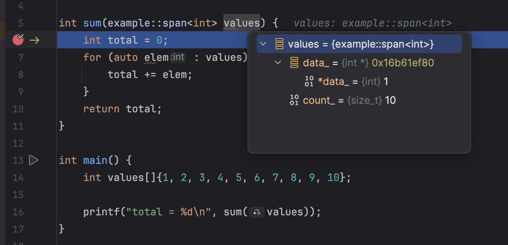
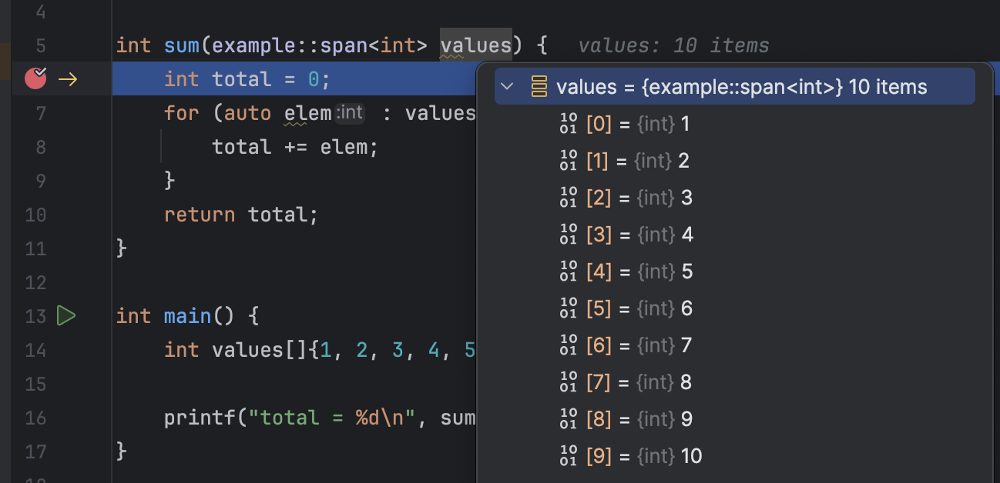
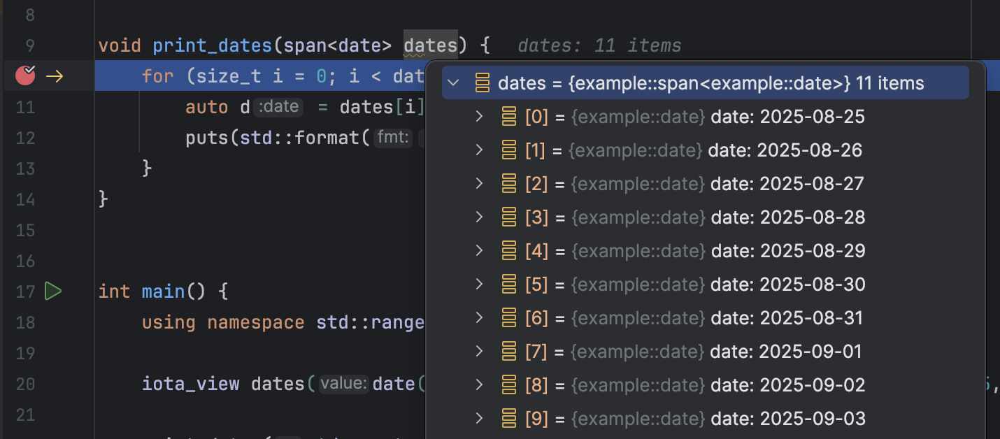
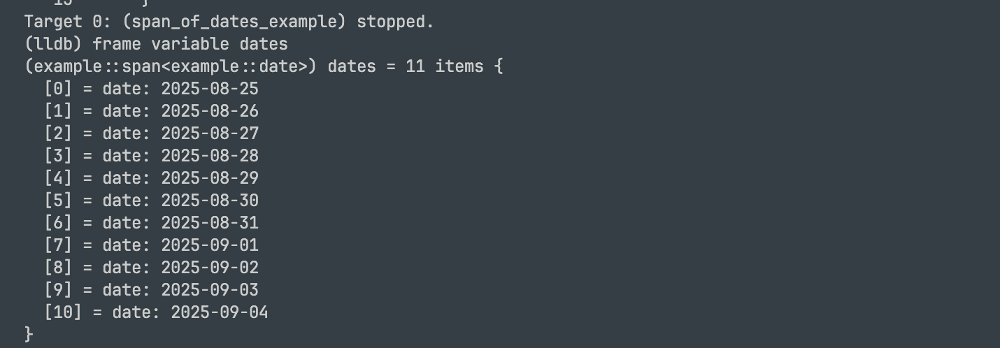
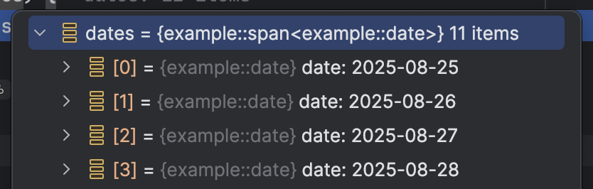

# Displaying User-Defined Types, In Your Debugger

Picture this. There's a bug in your code, you're trying to debug some problem
and you're using a user-defined container.

No problem, let's open a debugger, and -



Ah, hm. Where are all the values?

**This repo is intended to teach you how to display user-defined types and
containers in your debugger in a friendly, human-readable way, so you can get
from the above, to this:**





Output in `lldb`:



## How does this work?

LLDB provides **type summaries**, for printing user-defined types, and
**synthetic child providers**, for printing user-defined containers.

For more information, see
[https://lldb.llvm.org/use/variable.html](https://lldb.llvm.org/use/variable.html#variable-formatting)

## Steps

### Step 0: Enable loading `.lldbinit` for your project

Enable loading `.lldbinit` from the root of your project:

```sh
echo 'settings set target.load-cwd-lldbinit true' > ~/.lldbinit
```

With this enabled, lldb (or clion, running lldb) will automatically load
anything you put into the `.lldbinit` at the root of your project.

This makes it quick and easy to enter the debugger, with your custom type
printing already set up and configured for you to use.

### Step 1: Add a python file for printing your types

This repo uses `user_types/helper.py` to implement custom type printing.

#### User-Defined Objects: `example::date`

Our example `date` class stores a date as a number of days from the epoch:

```cpp
class date {
    /// Days since epoch (1970-01-01)
    int32_t days_;
  public:

    // ...

    year_month_day to_ymd() const {
        return std::chrono::sys_days(std::chrono::days(days_));
    }

    std::string to_string() const {
        auto ymd = to_ymd();
        return std::format("{:0>4}-{:0>2}-{:0>2}",
                           int(ymd.year()),
                           unsigned(ymd.month()),
                           unsigned(ymd.day()));
    }

};
```

Dates are displayed with the `print_date` function. This function:

1. Gets the `days_` member from `example::date`
2. Converts it to a python int, using `.GetValueAsSigned()`
3. Computes the corresponding python date, and then renders that as a string.

Here, `valobj` is an lldb `SBValue`.
[You can see the docs here.](https://lldb.llvm.org/python_api/lldb.SBValue.html)

```py
# C++ sys_days uses 1970-01-01 as the epoch
# however, datetime.date uses 0000-01-01 as the epoch
# so we need to add the number of days between these:
#
# This value is datetime.date(1970, 1, 1).toordinal()
DAYS_TO_EPOCH = date(1970, 1, 1).toordinal()

def print_date(valobj, internal_dict, options) -> str:
    m_days = valobj.GetChildMemberWithName("days_").GetValueAsSigned()
    py_date = date.fromordinal(DAYS_TO_EPOCH + m_days)
    return f"date: {py_date}"
```

Finally, when loading `helper.py`, we register `print_date` with `lldb` using
`type summary add`. You can put this in your `.lldbinit`, or you can execute it
from python when loading the python module:

LLDB code:

```lldb
type summary add --python-function helper.print_date example::date
```

Python code, using `debugger.HandleCommand()`:

```py
def __lldb_init_module(debugger, internal_dict):
    debugger.HandleCommand(
        "type summary add --python-function helper.print_date example::date"
    )
```

#### User-defined containers: `example::span<T>`

`example::span<T>` is more complex than `example::date` for two reasons:

1. It's a template, not a concrete type
2. It's a container, not a value type.

Nevertheless, we can teach lldb how to display it properly using a
[_synthetic child provider_](https://lldb.llvm.org/use/variable.html#synthetic-children):

```py
class SpanProvider:
    def __init__(self, valobj, internal_dict):
        self.valobj = valobj

    # Give python the _number_ of children in the container
    def num_children(self, max_children) -> int:
        # Get the count_ member from the span
        return self.valobj.GetChildMemberWithName("count_").unsigned

    # Get a child within the container
    def get_child_at_index(self, index):
        return self.valobj.GetValueForExpressionPath(f".data_[{index}]")
```

Finally, we make two calls to `lldb` to register it.

```lldb
type synthetic add -x "example::span<" --python-class helper.SpanProvider
type summary add --expand -x "example::span<" --summary-string "${svar%#} items"
```

Or, from python:

```py
def __lldb_init_module(debugger, internal_dict):
    # ...

    debugger.HandleCommand(
        'type synthetic add -x "example::span<" --python-class helper.SpanProvider'
    )
    debugger.HandleCommand(
        'type summary add --expand -x "example::span<" --summary-string "${svar%#} items"'
    )
```

Here, we add _both_ a type summary _and_ the synthetic provider. Here's a
breakdown of the arguments for both:

**The synthetic provider:**

- `-x "example::span<"` - match against types containing the name
  `example::span<`. This allows us to match against any instances of
  `example::span<T>`.

  lldb _also_ supports
  [callback-based matching](https://lldb.llvm.org/use/variable.html#callback-based-type-matching),
  but this is often overkill.

- `--python-class helper.SpanProvider` - informs lldb which python class to use
  as our synthetic child provider. It's `helper.SpanProvider`, rather than just
  `SpanProvider`, because the class is defined inside `helper.py`.

**The type summary:**

- `--expand` argument: this instructs that we should display any children of the
  type
- `-x "example::span<"` - match against types containing the string
  `example::span<`
- `--summary-string "${svar%#} items"` - this provides our
  [_summary string_](https://lldb.llvm.org/use/variable.html#summary-strings)
  for the type.

  `svar` represents an instance of the SpanProvider, and `${svar%#}` means "use
  the value obtained from `num_children()`".

`SpanProvider.get_child_at_index` returns an `SBValue`. The debugger knows the
type of the `SBValue`, so it handles printing it automatically, and we don't
have to worry about converting child objects into a string from the provider.



### Step 3: load the python file from `.lldbinit` for your project

We can load our python file ith `command script import <filename>`:

```
command script import user_types/helper.py
```

By putting this in the `.lldbinit` for your project, lldb (and clion, using
lldb) will load this whenever interacting with files in your project.
